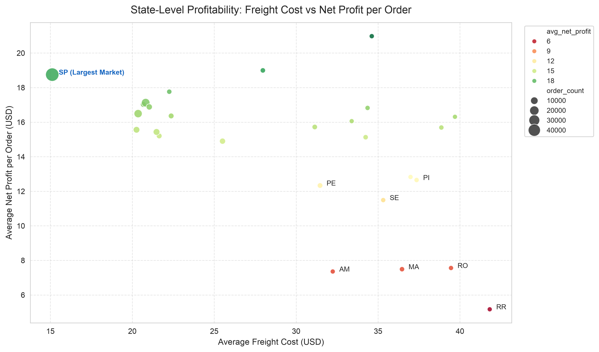
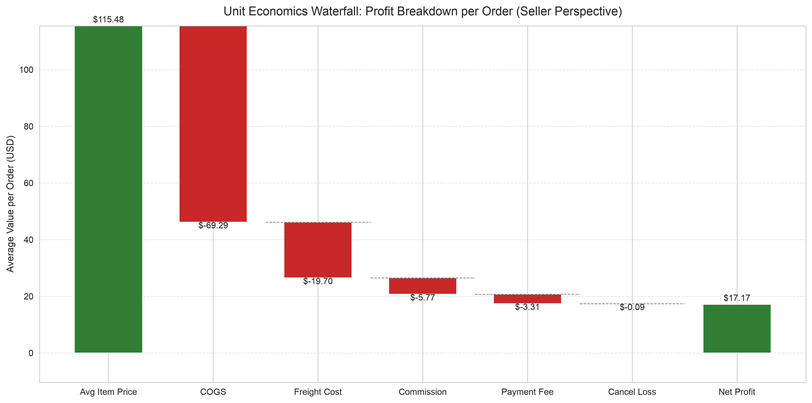
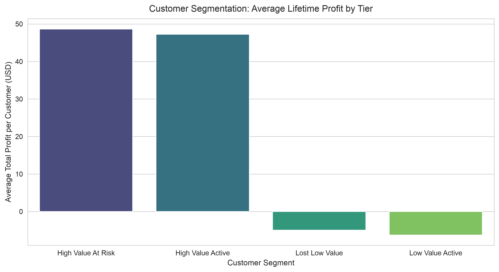

# Olist E‑commerce Profitability & Customer Value Analysis

End‑to‑end data analysis project for Brazilian e‑commerce marketplace,
simulating **third‑party seller perspective**: profit accounting, regional profitability analysis, statistical hypothesis testing,
R+M customer segmentation, and business strategy simulation.

All cost parameters are industry‑average hypothetical estimates, not official platform figures.

## Project Structure
E_commerce_Profit_Leakage_Analysis/
├── Data/                     # Raw Olist CSV datasets (not tracked by Git)
├── Notebook/
│   └── profit_analysis.ipynb  # Main analysis notebook
├── Report/
│   └── Images/                # Output visualization charts
├── .gitignore
├── LICENSE
└── README.md

## Dataset
- Source: [Kaggle Olist Brazilian E‑commerce Public Dataset](https://www.kaggle.com/olistbr/brazilian-ecommerce)
- Contains order, item, payment, customer, review and product category tables.
> ⚠️ Raw CSV files are **not committed to GitHub**.
> Download dataset and place all `.csv` files under `./Data/` folder to reproduce the analysis.

## Analysis Workflow
1. Data quality inspection & outlier treatment (1% Winsorization)
2. Seller‑oriented profit model construction: COGS, platform commission, payment fee, freight cost, cancellation loss
3. Regional profitability analysis & Levene‑test + independent t‑test for SP state market
4. Unit‑economics waterfall breakdown for per‑order profit components
5. Customer segmentation based on Recency + Monetary profit (low repurchase rate limits Frequency usage)
6. Business simulation: evaluate profit uplift by lifting high‑value order proportion in SP market

## Key Results
- Overall net profit margin: **14.87%**
- SP (largest market) average net profit per‑order: **$18.75**, national average: **$17.17**
- Customer repeat purchase rate: **3.05%**
- Business simulation: raising high‑value order share by 5 percentage points in SP yields **13.53%** incremental profit.

### Visual Outputs






## Business Insights
1. Freight cost is a major cost driver, but product category mix creates larger regional profit gaps. SP state achieves higher per‑order profit primarily because of significantly lower freight cost ($15.12 vs national $19.70), even though its average order price is lower than national level.
2. Statistical t‑test confirms SP state profit advantage is statistically significant(p‑value ≈ 0).
3. Repurchase behaviour in this dataset is extremely weak (repeat rate only 3.05%); segmentation should rely on Recency and Monetary profit rather than purchase frequency.
4. Two high‑value groups ("High Value Active", "High Value At Risk") generate almost all total profit. Low‑value segments bring net losses and offset part of total revenue. Retention for *High Value At Risk* customers is the top operational priority.
5. Simulation result: shifting SP market product mix, raising high‑value order proportion by 5 percentage points, can bring **13.53%** profit growth without changing total order volume.

## How to Reproduce
1. Clone repository
2. Download Olist dataset and put all csv files under `Data/`
3. Create conda / python environment:
```bash
pip install pandas numpy matplotlib seaborn scipy
4. Open `Notebook/profit_analysis.ipynb`, restart kernel and run all cells.
Charts will auto‑generate into `Report/Images/`.

## Notes

- Cost assumptions are simulated industry benchmarks only, not real Olist platform fee structure.
- Canceled / unavailable orders are modelled to bear full freight loss for sellers.